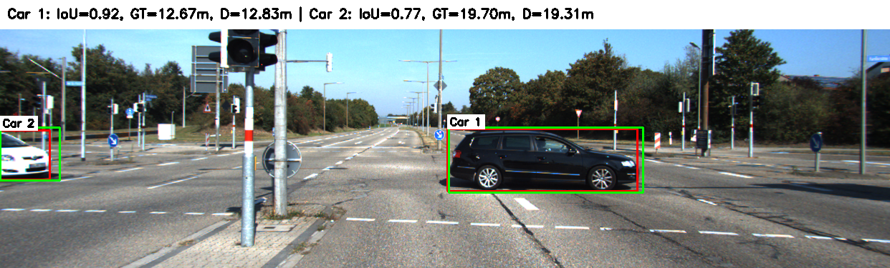
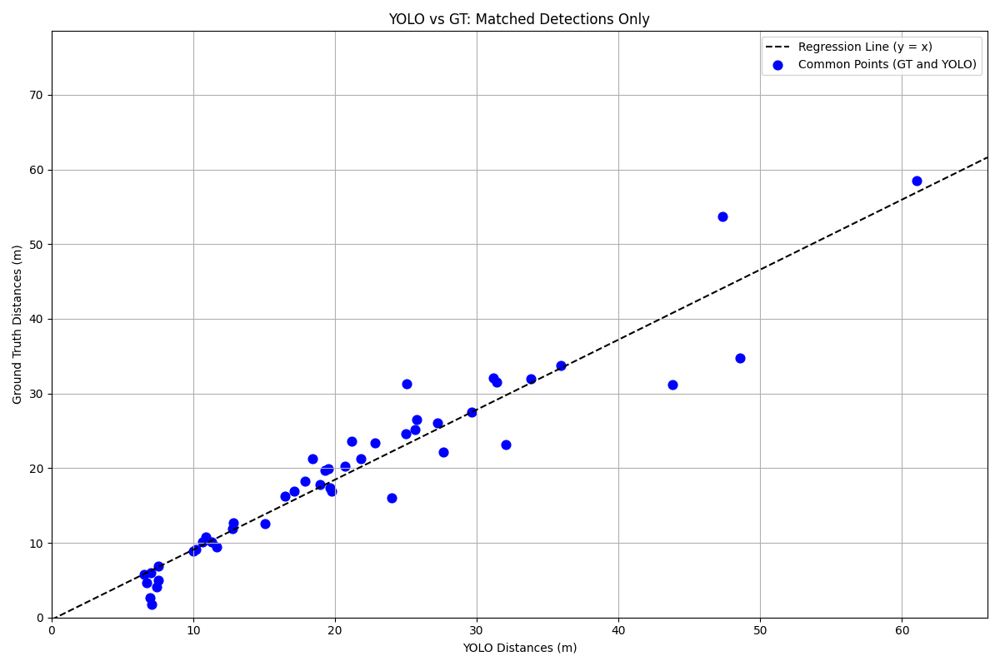

# 🚗 Object Detection and Depth Estimation with YOLOv8

This project implements a complete pipeline for detecting cars in KITTI images using YOLOv8, estimating their distances using camera calibration data, and evaluating detection accuracy against ground truth labels. It is developed for the RWU Computer Vision course.

---

## 📌 Project Overview

- 🧠 Detects cars using YOLOv8 pretrained on COCO
- 📐 Estimates 3D distance using intrinsic matrix and camera height
- 📊 Calculates Intersection over Union (IoU) for each detection
- 📈 Generates a CSV report and a global scatter plot comparing YOLO vs ground truth distances
- ✅ Matches detections only if IoU ≥ 0.75

---

## 🛠️ Technologies Used

- Python 3.10+
- [Ultralytics YOLOv8](https://docs.ultralytics.com/)
- OpenCV
- NumPy
- Matplotlib
- CSV

---

## 📁 Folder Structure

ObjectDetection_DepthEstimation/   
    ├── main.py                 # Annotated image output with bounding boxes code  
    ├── yolo_vs_gt.py           # CSV generation with per-car distance and IoU   
    ├── regression_graph.py     # Global scatter plot of matched detections   
── requirements.txt             # Python dependencies  
    ├── README.md               # Project documentation  
    ├── images/                 # KITTI input images   
    ├── labels/                 # Ground truth bounding boxes + depth   
    ├── calib/                  # Intrinsic matrices   
    └── output/                 # Annotated images, CSV, and scatter plot

---

## 🚀 How to Run

1. **Clone the repository**
- git clone https://github.com/<Atharvdahitule>/ObjectDetection_DepthEstimation.git
- cd ObjectDetection_DepthEstimation

2. **Install dependencies**
- pip install -r requirements.txt

3. **Prepare your data**
- Place KITTI images in images/
- Place ground truth labels in labels/ (format: car xmin ymin xmax ymax depth)
- Place intrinsic matrices in calib/ (each .txt file should contain a 3×3 matrix)
- Run the pipeline

4. **Annotated image output:**
- python main.py

5. **CSV report generation:**
- python distance_report.py

6. **Global scatter plot:**
- python scatter_plot.py

📊 Sample Output  
📍 Annotated Image  
   
 
📍 Scatter Plot  

References
- 📘 [Ultralytics YOLOv8 Documentation](https://docs.ultralytics.com/)
- 📘 [KITTI Dataset](https://www.cvlibs.net/datasets/kitti/)
- 📘 [OpenCV Camera Calibration](https://docs.opencv.org/4.x/dc/dbb/tutorial_py_calibration.html)
- 📘 RWU Computer Vision Task 2: Object Detection and Depth Estimation

👨‍🎓 Author  
Atharva U. Dahitule  
Master’s Student, Mechatronics Engineering  
RWU Hochschule Ravensburg-Weingarten, Germany

---
